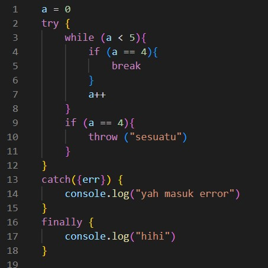
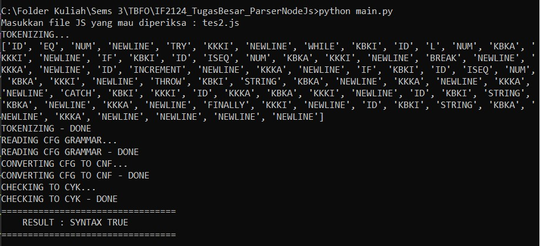
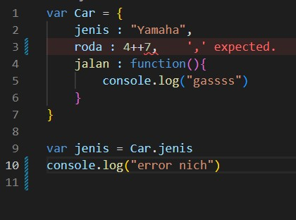
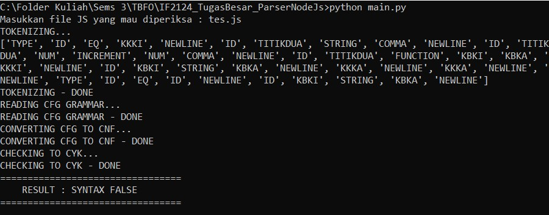

<h1> <b> TBFO_ParserNode.js </b> </h1>

## **Table of Contents**
* [Program Description](#program-description)
* [How to Run Program](#how-to-run-program)
* [Implementation Screenshots](#implementation-screenshots)
* [Team Members](#team-members)
* [Workload Distributions](#workload-distributions)
* [Folders and Files Description](#folders-and-files-description)
* [Extras](#meme-section)

## **Program Description**

 Dalam proses pembuatan program dari sebuah bahasa menjadi instruksi yang dapat dieksekusi oleh mesin, terdapat pemeriksaan sintaks bahasa atau parsing yang dibuat oleh programmer untuk memastikan program dapat dieksekusi tanpa menghasilkan error. Parsing ini bertujuan untuk memastikan instruksi yang dibuat oleh programmer mengikuti aturan yang sudah ditentukan oleh bahasa tersebut. Baik bahasa berjenis interpreter maupun compiler, keduanya pasti melakukan pemeriksaan sintaks. Perbedaannya terletak pada apa yang dilakukan setelah proses pemeriksaan (kompilasi/compile) tersebut selesai dilakukan.
 

## **How to Run Program**
1. Clone this repository  
`$ git clone https://github.com/NicholasLiem/IF2124_TugasBesar_ParserNodeJs.git `
2. Change the directory to the location where the main program is stored  
`$ cd IF2124_TugasBesar_ParserNodeJs`
3. Run the main program  
`$ python main.py`

## **Implementation Screenshots**
Screenshot contoh source code yang valid pada JavaScript
  
Screenshot hasil output *true* pada program 
  
Screenshot contoh source code yang tidak valid pada JavaScript
  
Screenshot hasil output *false* pada program 
  

## **Team Members**
1. Juan Christopher Santoso - 13521116
2. Nicholas Liem - 13521135
3. Nathania Calista Djunaedi - 13521139

## **Workload Distributions**
| NIM | Nama | Tugas |
|-------|--------|-------|
| 13521116 | Juan Christopher Santoso | Grammar, Regex, CYK, Lexer, dan Laporan |
| 13521135 | Nicholas Liem | CYK, Finite Automata, Lexer, dan Laporan |
| 13521139 | Nathania Calista Djunaedi | Grammar, Regex, CNF, Bonus, dan Laporan |

## **Folders and Files Description**
1. Folder Test  
Berisikan segala file .js yang ingin dites oleh program parser.
2. File *main.py*  
Berisikan program utama yang menggabungkan segala fungsi dan algoritma yang telah dibuat.
3. File *rules.py*  
Berisikan 'aturan' dalam pembacaan file .js menggunakan regex (*regular expression*).
4. File *FA.py*  
Berisikan file untuk melakukan pengecekan apakah nama variabel dan penulisan ekspresi telah benar menggunakan FA (*finite automata*).
5. File *grammar_cfg.txt*  
Berisikan aturan yang menjadi grammar dasar bagi syntax .js yang akan dites
6. File *grammar_reader.py*  
Berisikan algoritma untuk mengubah token yang telah dibaca menggunakan *rules.py* menjadi CNF (*Chomsky Normal Form*) berdasarkan grammar pada file *grammar_cfg.txt*.
7. File *cnf.txt*  
Berisikan aturan cnf yang telah dibuat menggunakan algoritma pada file *grammar_reader.py*
8. File *cyk.py*  
Berisikan file yang mengandung algoritma untuk membaca CFG (*Context Free Grammar*) berdasarkan CNF yang telah dibuat.
9. Folder *assets*  
Berisikan *screenshots* untuk ditampilkan pada README.

## **Meme Section**
